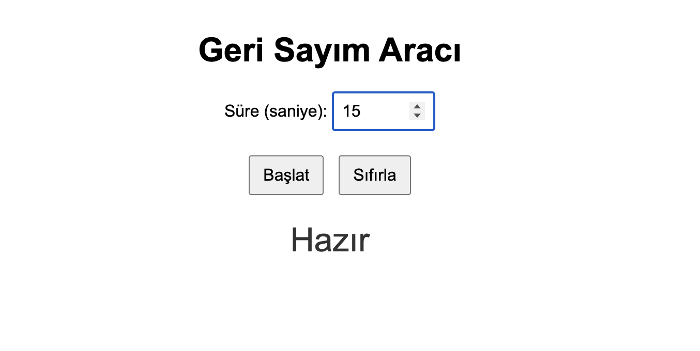

# ⏳ Geri Sayım Aracı

Bu küçük web uygulaması, kullanıcının belirlediği saniye süresince geri sayım yapar.

## 🔧 Özellikler

- Kullanıcı süreyi input alanından belirler
- "Başlat" butonuyla geri sayım başlar
- "Sıfırla" butonuyla sayaç durdurulur ve sıfırlanır
- Süre bitince "Süre doldu!" mesajı gösterilir

## 🗂️ Dosyalar

- `index.html` → HTML yapısı
- `style.css` → Basit stil düzenlemeleri
- `script.js` → Geri sayım mantığı (JavaScript)

## ▶️ Kullanım

1. Dosyaları aynı klasöre koy
2. `index.html` dosyasını tarayıcıda aç
3. Süreyi gir, başlat ve gözlemle!

---

Bu proje HTML, CSS ve JavaScript kullanılarak sade bir şekilde geliştirilmiştir.
