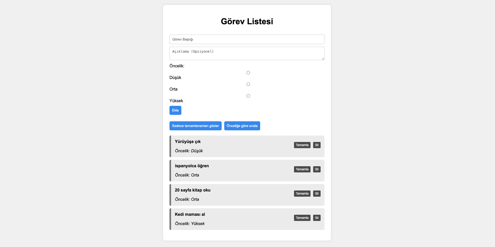

# 📝 Görev Listesi Uygulaması

Bu proje, HTML, CSS ve JavaScript kullanılarak oluşturulmuş dinamik bir görev listesi uygulamasıdır.

## 🚀 Özellikler

- Görev ekleme (Başlık, Açıklama, Öncelik)
- Tamamlandı olarak işaretleme
- Görev silme
- Form doğrulama ve hata mesajları
- Sadece tamamlananları filtreleme
- Önceliğe göre sıralama (Düşük → Yüksek)

## 📁 Dosya Yapısı

- `index.html` → Arayüz yapısı
- `style.css` → Sayfa tasarımı
- `app.js` → Uygulama mantığı (JavaScript)

## 💡 Kullanım

1. Sayfayı tarayıcıda aç.
2. Formu doldur ve "Ekle" butonuna tıkla.
3. Görevleri yönet!

> Not: Sayfa yenilendiğinde görevler sıfırlanır (veriler geçici olarak tutulur).
