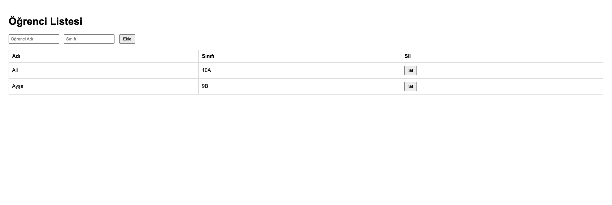

# Öğrenci Listesi Uygulaması

Bu basit web uygulaması, HTML, CSS, JavaScript ve jQuery kullanılarak geliştirilmiştir. Kullanıcılar, form aracılığıyla öğrenci bilgilerini ekleyebilir, listeyi görüntüleyebilir ve öğrencileri silebilir.

## Özellikler

- Statik JSON verisi ile başlangıçta 2 öğrenci görüntülenir.
- Yeni öğrenci eklemek için form alanı (Ad ve Sınıf).
- Öğrenci tablosundan satır seçme (renk değişimi).
- Öğrenci silme butonu ile listeden veri kaldırma.
- jQuery ile etkileşimli yapı.

